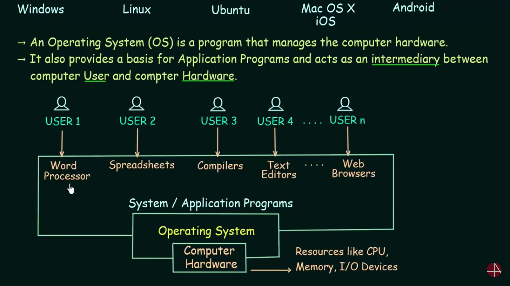

 <!-- OPERATING SYSTEMS -->

For a user to interract with the computer hardware there has to be a it has to run commands for every single action to be performed 
  In the above diagram if the OS is not present then the user 1 working with word has to write commads for every single operation
    load MS word in the RAM 
    when it writes something then write a command to display it on the screen 
    when he saves it then to save the content in hard drive etc
    
